# hangHae99Guide
### 이 repository 는 :
항해 99 부트캠프를 진행하면서 배우고 느낀 점을 기록하는 공간입니다.   
항해 99를 고려하고 있으시거나 궁굼하시다면 도움이 되길 바랍니다.   
<br/>
## 목차
* #### 프로젝트 
* #### 공부   
    * 웹개발 좋합반 1주차
    * 웹개발 종합반 2주차
    * 웹개발 종합반 3주차
    * 웹개발 종합반 4주차
    * 웹개발 종합반 5주차
    * 파이선 문법 뽀개기
    * 알고보면 알기쉬운 알고리즘 1주차
    * 알고보면 알기쉬운 알고리즘 2주차
    * 알고보면 알기쉬운 알고리즘 3주차
    * 자바 문법 뽀개기
    * 웹개발의 봄 스프링 1주차
    * 웹개발의 봄 스프링 2주차
    * 웹개발의 봄 스프링 3주차
    * 웹개발의 봄 스프링 4주차
    * 웹개발의 봄 스프링 5주차
    * Spring 심화반 1주차  
    * Spring 심화반 2주차
* #### 시스템   
    * 면접

<br/>

* ## 프로젝트
    * #### [Daily report](https://github.com/dohyung97022/DailyReport)
    * #### [Wanderer](https://github.com/hanghaeWeek1Team12/wanderer)
    * #### [DevMateBackend](https://github.com/hanghaeWeek5Team21/devMateBackend)/[DevMateFrontend](https://github.com/hanghaeWeek5Team21/devMateFrontend)   
<br/>

* ## 공부
    * ### 웹개발 종합반 1주차
      * #### 웹의 기초
        * <details>
          <summary>수업에서 제공된 내용</summary>
          <br>

          기본적인 html, CSS, javascript 관련된 기초들을 배웁니다.
          </details>
          <br>
        
        * <details>
          <summary>느낀 점</summary>
          <br>

          술자는 과거 프로젝트를 진행한 적이 있어 빠르게 넘어갔지만   
          1주차는 아마 코딩에 대한 지식이 전혀 없을 수 있는 초보분들을 고려한 내용으로 보입니다.   
          재미있는 점은 강의마다 숙제를 낸다는 점입니다.   
          좋은 여정이 되었으면 좋겠습니다. 
          </details>
          <br>
        
        * <details>
          <summary>숙제</summary>
          <br>

          CSS와 html의 기초적 이해를 요구하는 숙제...   
          CSS를 전에 많이 사용하였지만 AWS 자격증을 준비하느라 다 휘발성 메모리가 되었나 봅니다. ㅋㅋ   
          기억이 새록새록 돌아오는 경험이였습니다.   
          Inline styling, style block를 모두 연습삼아 활용했습니다.   
          [저의 정답](sparta/frontend/01_homework.html)   
          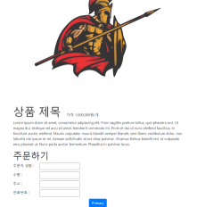   
          </details>
          <br>

    * ### 웹개발 종합반 2주차
      * #### jQuery
        * <details>
            <summary>수업에서 제공된 내용</summary>
          <br>
          
          * `https://ajax.googleapis.com/ajax/libs/jquery/3.5.1/jquery.min.js`
          * `$('#idselector')`
          * `$('#idselector').hide`
          * `$('#idselector').show`
          * `$('#idselector').val()`
          * `$('#idselector').val("anyValue")`
          * `$('#idselector').text("anyText")`
          * `$('#idselector').css("cssAtribute")`
          * `let tmp_btn = <button>click</button>` `$('#idselector').append(tmp_btn)`
          * `$('#idselector').empty()`
          </details>
          <br>

        * <details>
            <summary>느낀 점</summary>

          제공된 [html template](sparta\frontend\02_article.html)에서 `$('selector')`를 통해 사용할 수 있는 기능들에 대하여 배웠습니다.   
          jQuery는 javascript의 코드를 간략하게 하기 위한 라이브러리입니다.   
          저는 react 부터 시작한 사람이라서   
          static website에 jQuery를 통한 웹 기능 구현에 익숙하지 않았습니다.   
          S3 같은 곳에 static website의 구현을 요구할 지도 모르는데   
          아무리 현업이 react 범벅?이 되어 있다고 하더라도 이러한 방법을   
          이해하는 것도 중요하다고 생각됩니다.      
          간편하고 저렴하고 빠른 방법이 될 수 있겠다는 생각이 들었습니다.
          </details>
          <br>
  
        * <details>
            <summary>퀴즈</summary>
          
          [저의 정답](sparta/frontend/02_jQuery_quiz.html)   
          Static website에서 버튼 클릭으로 인한 기능을 jQuery로 구현하는 퀴즈였습니다.   
          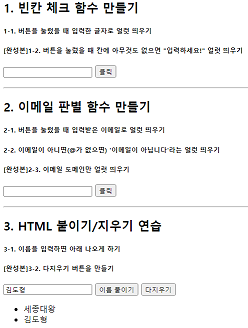
          </details>
          <br>
  
      * #### Ajax, JSON
        * <details>
          <summary>수업에서 제공된 내용</summary>
          <br>

          특정 url에서 Get 받기
          ```javascript
          $.ajax({ type: "GET", 
          url: "api.myapi.com",
          data: {},
          success: 
          function(response){
              console.log(response)
            }
          })
          ```
          </details>
          <br>

        * <details>
          <summary>느낀 점</summary>
          <br>

          Ajax는 jQuery에서 import되어 web response를 받는 라이브러리입니다.   
          저는 Ajax를 많이 들어본 적은 있었지만 직접적으로 사용해 본 적은 이번이 처음이였습니다.   
          React의 Axios framework를 사용하였지만 더 기본적인 라이브러리를 볼 수 있는 경험이였습니다.  
          다만 w3school은 ajax에서 XMLHttpRequest를 더 중심적으로 교육하는 것 같습니다.   
          API Hierarchy : jQuery.get/post > jQuery.ajax > XMLHttpRequest  
          참고 : [StackOverflow의 고인물들...](https://stackoverflow.com/questions/4657287/what-is-the-difference-between-xmlhttprequest-jquery-ajax-jquery-post-jquery)
          </details>
          <br>
          
        * <details>
          <summary>퀴즈</summary>
          <br>

          [서울 미세먼지 API](http://openapi.seoul.go.kr:8088/6d4d776b466c656533356a4b4b5872/json/RealtimeCityAir/1/99), [따릉이 API](http://spartacodingclub.shop/sparta_api/seoulbike), [카와이한 고양이 API](https://api.thecatapi.com/v1/images/search)   
          위 API를 통하여 static website를 변동시키는 퀴즈였습니다.   
          [저의 정답](sparta/frontend/02_Ajax_quiz.html)   
             
          아... 커여워....
          </details>
          <br>
          
      * <details>
        <summary>숙제</summary>
        <br>

        1주차 때 만들었던 템플렛에 환율 정보를 추가하는 것이 숙제로 나왔습니다.   
        [저의 정답](sparta/frontend/02_homework.html)   
        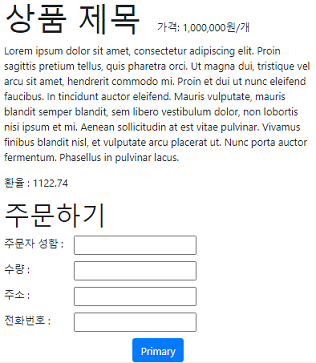
        </details>
        <br>
          
    * ### 웹개발 종합반 3주차
      * #### Python / BeautifulSoup
        * <details>
          <summary>수업에서 제공된 내용</summary>
          <br>
          
          가벼운 python 자료구조, syntax   
          `list = ['l','i','s','t']`   
          
          `dictionary = {'id':value}` `dictionary['id'] = value`
          ```python
          def func(param):
            return param
          ```
          ```python
          if a > 20:
            print(a)
          ```
          ```python
          for c in ['l','i','s','t']:
            print(c)
          ```
          ```python
          for c in [{name:kim,age:25},{name:jun,age:23},{name:min,age:20}]:
            print(c)
          ```
          `pip install`   
          
          Requset 모듈로 get 하기
          ```python
          import requests
          reqJson = request.get('url').json()
          ```   
          BeautifulSoup로 스크레이핑 하기
          ```python
          import beautifulSoup
          soup = BeautifulSoup(reqJson.text,'html.parser')
          soup.select_one('#id > .class > div')
          ```
          </details>
          <br>
          
        * <details>
          <summary>느낀 점</summary>
          <br>

          저는 크롤링/스크레이핑을 사랑합니다. 반가운 내용이 나왔네요.   
          그 외에는 기본적인 python 지식, 자료구조를 가볍게 넘어갑니다.   
          수업 내용은 쉬운 편입니다.   
          혹여나 크롤링/스크레이핑에 관심이 많으신 분이 게신다면 저만의 작은 팁이 있습니다.   
          같은 ip 주소에서 지속적으로 request를 보낼 경우 차단될 확률이 매우 높습니다.   
          그래서 ip를 우회해야 하는데, 저는 이 해결 방법으로 AWS lambda를 추천드립니다.  
          lambda는 5분마다 AWS ip pool에서 지속적으로 ip를 순환합니다.   
          심지어 더 많은 ip가 필요하시다면 그냥 코드로 lambda를 생성할 수 있습니다.   
          AWS SDK에서 async invocation도 가능해서 많은 request를 동시다발적으로 받을 수 있습니다.   
          핵꿀팁이라서 이 글을 읽으시는 분들에게만 드립니다... ㅋㅋ   
          저만 알고있는 꿀팁 맞죠? ;;;;
          </details>
          <br>
  
      * #### Python / pymongo (mongoDB)
        * <details>
          <summary>수업에서 제공된 내용</summary>
          <br>
          
          * 설치   
            * C:\data\db 파일을 만든다.   
            * [다운로드](https://www.mongodb.com/try/download/community?tck=docs_server)에서 windows용 exe 파일을 받는다.   
            * mongoDB installer에서 custom -> browse -> c/data/db 파일로 설정한다.   
            * Install mongoDB compass는 취향입니다.   
            * [mongo3T](https://robomongo.org/download)를 설치해주세요.   
            * C:\data\db\bin를 환경변수 -> 시스템 변수 -> path에 추가해주세요.   
            * cmd에서 mongod를 치면 DB 실행이 됩니다.   
          <br>
   
          기본 structure
          ```python
          from pymongo import MongoClient

          client = MongoClient('localhost', 27017)
          db = client.schema
          ```
          
          (단일 / 다중) 입력
          ```python
          # insert
          doc = {'name': 'kim', 'age': 25}
          db.users.insert_one(doc)
          doc = [{'name': 'min', 'age': 20}, {'name': 'jun', 'age': 23}]
          db.users.insert_many(doc)
          ```
          조건에 맞는 결과 찾기
          ```python
          # find
          same_ages = list(db.users.find({'age': 21}, {'_id': False}))
          user = db.users.find_one({'name': 'bobby'}, {'_id': False})
          ```
          (단일 / 다중) 변환
          ```python
          # update
          db.users.update_one({'name': 'bobby'}, {'$set': {'age': 19}})
          db.users.update_many({'age': 19}, {'$set': {'name': 'adult'}})
          ```
          삭제
          ```python
          # delete
          db.users.delete_one({'name': 'bobby'})
          ``` 
          </details>
          <br>
          
        * <details>
          <summary>느낀 점</summary>
          <br>

          pymongo의 CURD 기능에 대한 소개와   
          스크레이핑을 통해 받은 정보를 저장합니다.   
          </details>
          <br>
          
        * <details>
          <summary>퀴즈</summary>
          <br>

          [저의 정답](sparta/backend/python/03_python_MongoDB_Quiz.py)   
          퀴즈는 메트릭스의 평점을 scraping 하는 것입니다.   
          이미 제공되고 해설하는 문제를 푸는 것은 좋지 않다고 생각되어   
          네이버의 최신 영화 api를 훔쳐?보도록 하겠습니다.   
          [네이버의 backend](https://m.search.naver.com/p/csearch/content/qapirender.nhn?_callback=___MovieAPIforPList_key_68_pkid_nexearch_where_1_start_8_display_s1_dsc_so_%ED%98%84%EC%9E%AC%EC%83%81%EC%98%81%EC%98%81%ED%99%94_q&key=MovieAPIforPList&pkid=68&where=nexearch&start=1&display=8&so=s1.dsc&q=%ED%98%84%EC%9E%AC%EC%83%81%EC%98%81%EC%98%81%ED%99%94)
          는 url의 where 이후의 숫자와, &start의 파라미터의   
          숫자에 따라 결과를 달리합니다.
          ```python
          for x in ['1', '9', '17', '25', '33']:
          reqHtml = requests.get(
          'https://m.search.naver.com/p/csearch/content/qapirender.nhn?_callback=___MovieAPIforPList_key_68_pkid_nexearch_where_' 
          + x
          + '_start_8_display_s1_dsc_so_%ED%98%84%EC%9E%AC%EC%83%81%EC%98%81%EC%98%81%ED%99%94_q&key=MovieAPIforPList&pkid=68&where=nexearch&start=' 
          + x
          + '&display=8&so=s1.dsc&q=%ED%98%84%EC%9E%AC%EC%83%81%EC%98%81%EC%98%81%ED%99%94')
          ``` 
          다음과 같이 웹에서 사용되는 것을 따라하여 8씩 증가하며 get을 하였습니다.   
          그 이후 beautifulsoup을 사용하려고 하였지만 html에 특화되어 있어   
          Json api call을 받아들이지 못해 그냥 regex를 사용하였습니다.   
          regex 애용한답니다. ㅋㅋ   
          ```
          'this_text _text\\\\">([^<]+)'
          ```
          결과   
          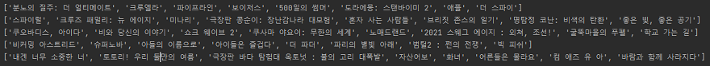
          그 이후 형식을 변환하고 저장합니다.
          ```python
          # array 형식을 dictionary 형식으로 바꾼다.
          movieDicArr = []
          for movieName in movieArr:
          movieDicArr.append({'name': movieName})
          
          # 저장한다.
          db.users.insert_many(movieDicArr)
          ```
          결과   
          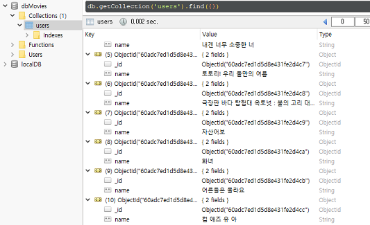
          </details>
          <br>
        
      * <details>
        <summary>숙제</summary>
        <br>

        지니뮤직에서 top 50 곡과 그 아티스트를 받는 숙제입니다.   
        [저의 정답](sparta/backend/python/03_homework.py)   
        ```python
        titles = re.findall('class="albumtitle[^>]+>([^<]+)<', reqHtml.text)
        artist = re.findall('class="artist[^>]+>([^<]+)<', reqHtml.text)
        ```
        이것도 regex를 사용하여 간단히 했습니다.
        </details>
        <br>
  
    * ### 웹개발 종합반 4주차
      * #### Flask
        * <details>
          <summary>수업에서 제공된 내용</summary>
          <br>

          기본 틀
          ```python
          from flask import Flask

          app = Flask(__name__)

          @app.route('/')
          def home():
            return 'This is Home!'
  
          if __name__ == '__main__':
            app.run('0.0.0.0', port=5000, debug=True)
          ```
          html 템플릿 리턴
          ```python
          from flask import Flask, render_template
          @app.route('/')
          def home():
            return render_template('index.html')
          ```
          Get request와 ?parameter 받기
          ```python
          @app.route('/test', methods=['GET'])
          def test_get():
            parameter = request.args.get('parameter')
            return jsonify({'result': 'success', 'msg': '이걸 주셨나요?' + parameter})
          ``` 
          Post request와 body parameter 받기
          ```python
          @app.route('/test', methods=['POST'])
          def test_post():
            post_body_parameter = request.form['body_parameter']
            return jsonify({'result': 'success', 'msg': '이 요청을 주셨나요?' + post_body_parameter})
          ```
          </details>
          <br>
        
        * <details>
          <summary>느낀 점</summary>
          <br>

          이번 시간에는 플라스크의 파일구조와   
          Get/Post request와 url parameter, body parameter를 받는 방법을 배웠습니다.   
          그런데 세상에 마상에...   
          이렇게 간략한 프레임워크가 있다구요?   
          스프링으로는 최소한 `@Entity`, `@Repository`, `@Service`   
          로 구성된 틀을 짜야 하는데... 여기에서는 7줄로 서버가 완성되는 magic 이 일어나고 있습니다.   
          그러나!!!!   
          플라스크보다 스프링이 좋은 이유들도 있습니다.   
          * 스프링의 경우 database integration이 되어 있습니다.
          * 객체 지향적이여서 파일 정리가 쉽습니다.
          * 데이터베이스 또한 하나의 객체로 봅니다.
          * 속도가 스프링이 더 빠릅니다.   
          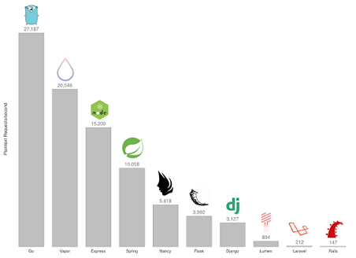   
            Go 가 제일 빠른데 취직 자리도 없다는게 함정... 슬프다...   
            그냥 spring으로 시작할껄...
          </details>
          <br>
        
      * #### Flask + MongoDB + Ajax + jQuery + beautifulSoup
        * <details>
          <summary>수업에서 제공된 내용</summary>
          <br>

            위에서 배운 모든 내용들을 종합하는 내용이였습니다.  
            <br>
            1. Flask로 api를 연다.   
            2. MongoDB로 저장하는 api route를 연다.
            3. Ajax와 jQuery로 parameter로 받는다.   
            4. frontend에 표시한다.
            5. Scraping 또한 활용한다.
          </details>
          <br>

        * <details>
          <summary>느낀 점</summary>
          <br>
            
            프로젝트를 전체적으로 설계/조립하는 것만큼 [satisfaction](https://www.youtube.com/watch?v=a0fkNdPiIL4) 한 것은 없습니다.   
            또한 이번 수업에서 들어 내용 중에 카카오톡이 어떻게   
            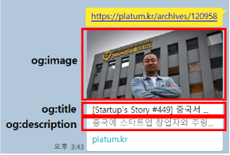   
            이러한 기능을 구현한 것인지에 대한 예기가 있었습니다.   
            meta 태그에 이러한 정보들을 넣는 것이 웹의 보편적인 약속인 것을 처음 알았습니다.   
            제 project엔 이런것도 안 넣었는데...   
            조금 공부할 필요가 있네요.   
            [구글/카톡을 위한 react에서 meta tag 지정 방법](https://satisfactoryplace.tistory.com/150)   
            <br/>
            저의 개인적인 감상은 그만두고 조금 더 보편적으로 이야기하자면   
            오늘은 정말 유용한 강의였습니다.   
            어느정도 웹의 특정 부분만 이해하는 사람이라면  
            조금 더 큰 그림을 보여주는 강의였다고 생각합니다.   
            전체적인 구조를 보여주는 프로젝트도 2개나 보여줍니다.   
            <br>
            frontend + backend + mongoDB
          
            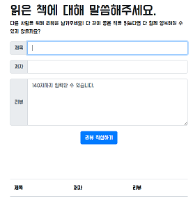   
            <br>
            frontend + backend + mongoDB + beautifulSoup   
            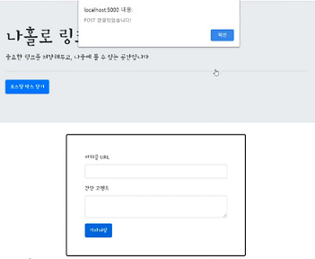
          </details>
          <br>
          
      * <details>
          <summary>숙제</summary>
          <br>
        
          나의 정답 [index.html](sparta/backend/python/04_homework/templates/index.html) / [app.py](sparta/backend/python/04_homework/app.py)   
          이번에는 중간 정도의 난이도가 있는 숙제였습니다.   
          하지만 강의에서 나온 예시를 잘 들어주신 분이라면   
          큰 문제 없이 풀 수 있는 난이도였습니다.   
          <br>
          숙제의 내용은   
          <br>
          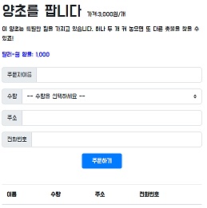   
          다음 웹페이지에서부터 입력받은 정보를   
          <br>
          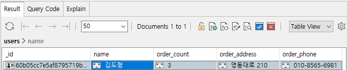   
          mongoDB를 통해 저장하고   
          <br>
          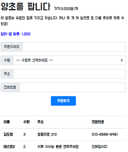   
          저장된 정보를 아래에 표시되게 하는 것입니다.   
          <br>
          </details>
          <br>
  
    * ### 웹개발 종합반 5주차
      * #### 4주차 복습
        * <details>
          <summary>수업에서 제공된 내용</summary>
          <br>

          pymongodb에서의 sort
          ```python
          mycol = db["database"]
          sorted = mycol.find().sort("name" , -1)
          ```
          moviestar html template, backend 예시   
          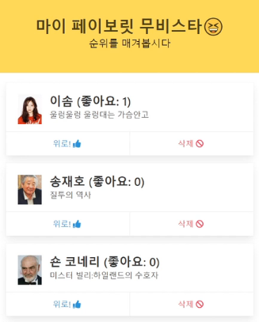
          
          Static html에서 reload 하는 방법
          ```javascript
          window.location.reload()
          ```
          </details>
          <br>
        * <details>
          <summary>느낀 점</summary>
          <br>
          
          이번 수업에서는 1~4주차까지의 내용을 모두 활용하는 내용이였습니다.   
          좋아요를 누르면 그 개인의 순위가 위로 올라가는 기능을 구현하지만   
          결국 활용하는 내용은 같아 복습한다는 느낌으로 진행됩니다.
          </details>
          <br>
        
      * #### AWS
        * <details>
          <summary>수업에서 제공된 내용</summary>
          <br>
  
          EC2 구매하기   
          SSH 하는 방법   
          FTP (filezilla) 사용하기   
          가벼운 linux terminal commands   
          `mkdir`, `chmod`, `cd`, `ls -la`
          
          EC2에서 flask, mongoDB 활용하기   
          EC2 Security group   
          shell 파일을 통한 설치 자동화   
          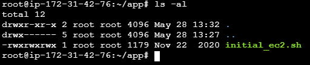   
          nohub를 통한 배포의 지속   
          `nohup python app.py &`   
          Process 번호를 찾는 방법, 프로세스 중지 방법   
          `ps -ef`
          `ps -ef | grep 'app.py'`
          `kill -9 105929`   
          도메인 등록, 연결   
          </details>
          <br>
          
        * <details>
          <summary>느낀 점</summary>
          <br>
          
          초보자 분들을 위한 강의로는 손색이 없을 정도로 좋습니다.  
          [동빈나님](https://www.youtube.com/channel/UChflhu32f5EUHlY7_SetNWw) 이나 [생활코딩님](https://www.youtube.com/user/egoing2) 
          의 팬이라면 이미 아시는 내용일 수도 있습니다.   
          저는 ec2와 AWS를 활용한 배포는 [시험 공부](https://github.com/dohyung97022/awsGuide) 나 [프로젝트](https://github.com/dohyung97022/ADIY) 를 해서 많이 알고 있지만   
          그럼에도 다른 프레임워크인 flask나 mongoDB를 통한 배포는 색다른 느낌을 주었습니다.
          
          경험자 비 경험자 모두 추천드리는 좋은 강의였습니다.   
          
          보통은 AWS RDS에 데이터베이스를 따로 만들고 EC2와 분리하지만   
          이번 강의는 하나의 EC2에 데이터베이스 + backend + frontend를 모두 통합합니다.
          
          너무 좋은 강의였음에도 불구하고 아쉬운 점을 추가하자면...   
          CORS에 대한 내용이 없어 초보자 분들이 해맬 수 있다고 생각했습니다.   
          도메인을 변경하게 되면 모든 html이나 application의 request 도메인을 일치시켜여 하는데   
          이전에 숙제를 한 localhost나 EC2의 IP로 접근할 경우 CORS가 뜨며 오류가 발생합니다.   
          이점을 조금 더 개인적으로 공부하시면서 보완하신다면 좋을 것 같습니다.   
          </details>
          <br>
  
      * <details>
        <summary>숙제</summary>
        <br>

        숙제는 수업 내용의 url을 제출하는 것이였습니다.   
        http://www.herokusu.com:5000/ 제 숙제의 링크입니다.   
        IE로 접근하시면 database 가 연결이 안됩니다...   
        어짜피 IE 사용하는 분들 없죠?      
        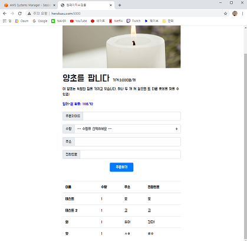
        </details>
        <br>
        
    * ### 파이선 문법 뽀개기
      * #### 파이선 문법 기초
        * <details>
          <summary>수업에서 제공된 내용</summary>
          <br>
  
          변수와 포인터 개념   
          
          사칙연산   
          `**` `+` `-` `^` `%`   
          
          bool, string, int   
          
          타입의 변환   
          `str(12)` `int('12')`
          
          타입의 다양한 연산   
          `len()` `arr[0]` `arr[3:5]` `str.split('@')`
          
          List   
          `list[a,'문자',13]`  `list.append(a)` `list.sort()` `(5 in list)`
          
          Dictionary   
          `dic={'name':'kim','age':25}` `dic[name]` `(age in dic)`   
          
          List of Dictionary   
          `[{name:'kim'},{name:'jun'}]`   
          
          List of List   
          `[['2차'],['리스트']]`   
          
          Dictionary of Dictionary   
          `{id:'dohyung97022',pw:'123',user:{name:'kim'}}`
          
          조건문   
          `if():` `else:` `elif():`
          
          반복문   
          `for a in arr:` `break` `for i, a in enumerate(arr):`

          </details>
          <br>
          
        * <details>
          <summary>느낀 점</summary>
          <br>
  
          기초적인 파이선 문법입니다.   
          별로 특별한건 없었어요.    
          다만 저는 반복문의 enumerate는 처음 보았습니다. ㅋㅋ      
          Noob !! ~
          
          </details>
          <br>
      
      * #### 파이선 문법 심화
        * <details>
          <summary>수업에서 제공된 내용</summary>
          <br>
  
          튜플   
          `(a,12)`   
          
          집합   
          `arr = [1,1,1,2,3,4,4,5]`
          `sett = set(arr)` `aSet = {1,2,3,4,5}`   
          `aSet & bSet` `aSet | bSet` `aSet - bSet`
          
          f-string   
          `f'{name}은 나이 {age}에 f-string을 모르는 noob입니다.'`
          
          예외처리   
          `try: except:`   
          
          파이선 파일 관리
          ```python
          #funcs.py
          def func1():
             print('func1')
          def func2():
             print('func2')
          ```
          ```python
          # main.py
          from funcs.py import func1
          func1()
          ```
  
          map function   
          ```python
          people = [
          {'name': 'bob', 'age': 20},
          {'name': 'carry', 'age': 38},
          {'name': 'john', 'age': 7},
          ]
          ```
          ```python
          def check_adult(person):
            if person['age'] > 20:
              return '성인'
            else:
              return '청소년'

          result = map(check_adult, people)
          print(list(result)) # ['청소년','성인','청소년']
          ```
          
          filter function   
          ```python
          def check_adult(person):
            if person['age'] > 20:
              return True
            else:
              return False

          result = filter(check_adult, people)
          print(list(result)) # [{'name': 'carry', 'age': 38}]
          ``` 
          
          function 심화
          ```python
          # param의 순서 변환
          def changedOrder(a,b):
            return a+b
          changedOrder(b=1,a=2)
          
          # 기본 param
          def ifNotGiven(a=100):
            return a
          ifNotGiven()
          
          # 무제한 params
          def unlimitedParam(*args):
            for i in args:
               print(i)      
          unlimitedParam(1,2,3,4,5)
          
          # kwargs dictionary
          def kwargsDictionary(**kwargs):
             print(kwargs)
          kwargsDictionary(name='kim',age=25)
          # {name:'kim',age:25}
          ``` 
          class 구조
          ```python
          class Monster():
            hp = 100
            alive = True

            def damage(self, attack):
              self.hp = self.hp - attack
              if self.hp < 0:
                self.alive = False

            def status_check(self):
              if self.alive:
                print('살아있다')
              else:
                print('죽었다')

          m = Monster()
          m.damage(120)

          m2 = Monster()
          m2.damage(90)

          m.status_check()
          m2.status_check()
          ```
          </details>
          <br>
          
        * <details>
          <summary>느낀 점</summary>
          <br>
          
          저는 특정 언어를 사용한다고 할 때 그 언어를 깊게 판 사람의 코드와   
          겉핥기 식으로 한 사람의 코드는 다르다고 생각합니다.   
          물론 이 강의는 겉핥기 식의 강의였지만 수강자들에게 방향성을 주는 것이 좋았다고 생각합니다.   
          언어를 깊게 판 사람은 예술의 경지에 다다른 code를 짤 수 있습니다.   
          특정 기능을 구현한다고 할 때 구구절절 구현하기보다 기초 라이브러리에서 찾아 쓰고   
          언어마다 class나 function의 구조적 원칙을 이해하여 그 규칙을 따릅니다.   
          구글링도 좋지만 가끔은 강의나 책도 좋습니다.   
          이러한 기능이 있었구나... 하고 어렴풋이 기억해도 성공입니다.   
          그 기능을 사용하여 코드베이스를 간략화 할 수 있으니까요.   
          이상 입만 살아있는 코더였습니다. ㅋㅋㅋㅋ
          </details>
          <br>

    * ### 알고보면 알기쉬운 알고리즘 1주차
      * #### 시간/공간 복잡도, 점근 표기법
        * <details>
          <summary>수업에서 제공된 내용</summary>
          <br>
          
          간단한 기초적 빅 오 표기법, 세타 표기법에 대하여 나옵니다.   
          메모리를 사용하는 공간복잡도, 알고리즘 자체의 성능인 시간복잡도의 간략한 설명이 나옵니다.   
          </details>
          <br>
    
        * <details>
          <summary>느낀 점</summary>
          <br>
            
            이번 년도 초기에 혼자서 안경잡이 개발자의 알고리즘 강의를 보며 공부하고   
            백준 문제도 많이 풀어봤는데 저만 항상 볼때마다 새로워 보이나요? ㅋㅋ   
            숙제가 분명히 쉬운 문제인데 왜 기억이 안날까요? ㅋㅋ    
          </details>
          <br>
    
      * <details>
        <summary>숙제</summary>
        <br>
        
        저는 분명해 에스토스테네스의 체를 배웠습니다.   
        그런데 머릿속에 어렴풋이 상상이 되지만 왜 손은 멈춰있을까요?   
        ...눈물....
        
        ```python
        input = 20
        
        def find_prime_list_under_number(number):
            # 저의 정답
            # 에스토스테네스의 체
            # 1. 한개씩 숫자를 지나간다.
            # 2. 한개씩 숫자를 지나가며 소수를 찾는다.
            # 3. 소수를 찾았다면 그 소수의 배수를 지운다.
            # 4. 1을 반복한다.
        
            arr = []
            for i in range(3, input + 1): # range(int1, int2) 이거 까먹음...
                arr.append(i)
        
            for i in arr:
                eraser = i
                while eraser <= 20:
                    eraser += eraser
                    # 기존 생각
                    if eraser in arr:
                        arr.remove(eraser)
                    # 나중 생각
                    try:
                        arr.remove(eraser)
                    except:
                        pass
        
            return arr
        
        result = find_prime_list_under_number(input)
        print(result)
        ``` 
        
        기존 생각에서 if earser in arr: 가 arr를 loop로 돌 것 같아   
        try catch로 바꿨습니다.   
        한번 겉눈질 하고 직접 풀었지만...   
        오랜만에 해서 그런지 조금 걸렸습니다...   
        </details>
        <br>
        
    * ### 알고보면 알기쉬운 알고리즘 2주차
      * #### 기초적 자료구조
        * <details>
          <summary>수업에서 제공된 내용</summary>
          <br>
          
          Array, linkedList, class, 이진탐색
          기본적인 내용들이 나옵니다.   
          생각보다 정리가 잘 되어 있었습니다.   
          간략한 핵심만을 예기합니다.   
          아시는 분은 2배속으로 보고 빨리 넘어가세요~   
          직접 자료구조를 만들어보는 데에 부족함을 느껴서   
          [이부분을 자세하게 봤습니다.](sparta/algorithms/week2/linkedList.py)   
          </details>
          <br>
    
        * <details>
          <summary>느낀 점</summary>
          <br>
            
          c++로 linkedlist를 만드는데 훨씬 어려웠던 것 같은데   
          파이선으로 구현하면 왜 쉽게 느껴지는지 의야합니다.   
          
          또한 이진탐색은 역시 구현할 때 중간에 기준값을 기준으로   
          작은지 작거나 같은지, 큰지 크거나 같은지, 그 구분이 항상   
          햇갈렸던 것 같습니다.   
          그래서 그냥 간단하게   
          
          같은 경우   
          작은 경우   
          큰 경우   
          이 세가지로 나눴습니다.   
          </details>
          <br>
    
      * <details>
        <summary>숙제</summary>
        <br>
        
        1. 숙제로는 링크드 리스트에서 끝에서 3번째 값 출력      
        2. 배달의 민족 배달 가능 여부   
        3. 더하거나 빼거나    
        
        문제가 나왔습니다.   
        
        a. 의 경우 링크드 리스트의 자료구조를 조금 바꿔서   
        prev를 추가하였습니다.
        ```python
        class Node:
        def __init__(self, data):
        self.data = data
        self.next = None
        self.prev = None
        ``` 

        append 될 때 prev를 정의하게 하였고   
        이를 사용해서 값을 구했습니다.   
        ```python
        def append(self, value):
        cur = self.head
        while cur.next is not None:
        cur = cur.next
        cur.next = Node(value)
        cur.next.prev = cur
        ``` 
        
        b. 의 경우 이분탐색을 이용했습니다.   
        파이선의 경우 array가 한글로 이뤄져 있어도 sort가 가능한가 봅니다.   
        ```
        def order_binary(menus, order):
        # 1. 한글을 정렬한다.
        menus.sort()
        # 2. 2분 탐색한다.
        # 2-0. 길이가 없다면 false를 반환
        if len(menus) == 0:
        return False
        # 2-1. 중앙값 지정
        mid = int(len(menus)/2)
        # 2-2. 중앙값과 일치한다면 true
        if menus[mid] == order:
        return True
        # 2-2. 중앙값보다 작다면 0~중앙값-1
        elif order < menus[mid]:
        return order_binary(menus[0:mid], order)
        # 2-3. 중앙값보다 크다면 중앙값+1~len(menus)
        elif order > menus[mid]:
        return order_binary(menus[mid+1:len(menus)], order)
        ``` 
        
        c. 의 경우 저의 굳은 머리로는 왜 bsf밖에 떠오르지 않을까요?   
        분명 2주차까지 bsf를 배우지 않았는데 방법이 떠오르지 않습니다... ㅜㅜ   
        <s>역시 코딩테스트는 아이큐테스트...</s>
        </details>
        <br>   

  * ### 알고보면 알기쉬운 알고리즘 3주차
    * #### 정렬/스택/큐/해쉬
      * <details>
        <summary>수업에서 제공된 내용</summary>
        <br>

        버블정렬/선택정렬/병합정렬   
        스택/큐   
        해쉬   
        </details>
        <br>

      * <details>
        <summary>느낀 점</summary>
        <br>

        버블정렬이 2가지를 비교한다는 것은   
        기억을 했지만, 그로 인해 결국 마지막 인덱스의 값이   
        순차적으로 정렬된다는 것은 기억하지 못했네요.      
        
        선택정렬은 말할 필요도 없이 가장 비효울적입니다.   
        
        병합정렬은 많이 햇갈려서 영상을 보면서 구현했습니다.   
        결국에는 2개 배열을 병합하는 것을 분할정복 하는 것이지만   
        [2개의 배열을 병합하는 것에서 좀 해매다가 보고 했다는게 함정](sparta/algorithms/week3/mergeSort.py)
        
        제공된 분할정복은 아름답습니다.
        ```python
        def merge_sort(arr):
            if len(arr) == 1:
                return arr
            mid = int(len(arr)/2)
            left_arr = merge_sort(arr[:mid])
            right_arr = merge_sort(arr[mid:])
            return merge(left_arr, right_arr)
        ``` 
        <s>아니면 파이선이 쉬운건가?   
        쉬워서 아름답게 느꺼지는 건가? </s>
        
        추가적으로 모든 수업 내용들은 본인이 직접 구현해보라고 코드스니핏을 줍니다.   
        [저의 스택 구현](sparta/algorithms/week3/stack.py)   
        [저의 큐 구현](sparta/algorithms/week3/queue.py)
        
        해쉬맵 구현은 부족함을 느껴 강의를 보며 따라 했습니다.   
        파이선의 경우 해쉬값을 이렇게 지정해주셨습니다.   
        `hash(key) % len(self.items)`    
        
        `len(self.items)`로 나눈 나머지는 0 ~ `len(self.items)-1`사이에 존재하는 것을 이용한 것 같습니다.   
        
        그 외에는 통상적인 해쉬맵을 따릅니다.   
        강의에서는 각 인덱스의 value에 linkedTuple를 넣었습니다.   
        
        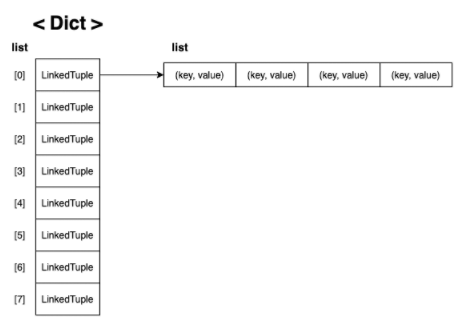
        
        linkedTuple에서 key value로 이뤄지는 이유는 해쉬 값으로 array를 찾으면   
        그 이후 해쉬키 이전의 키값 자체로 value를 찾기 위해서입니다.   
        </details>
        <br>

    * <details>
      <summary>숙제</summary>
  
      <br>
  
      </details>
      <br>

  * ### 자바 문법 뽀개기
    * #### 기초 문법
      * <details>
        <summary>수업에서 제공된 내용</summary>
        <br>
  
        [변수, 상수](sparta/backend/java/VarAndConst.java)   
        [타입](sparta/backend/java/Types.java)   
        [array](sparta/backend/java/Arrray.java)   
        [연산](sparta/backend/java/Operators.java)   
        [조건문](sparta/backend/java/Conditional.java)   
        [반복문](sparta/backend/java/Loop.java)   
        
        기초적인 문법 내용들이 나옵니다.   
        </details>
        <br>

      * <details>
        <summary>느낀 점</summary>
        <br>

        언어들마다 다른 점 중에서 변수 선언을 할 때의 default 가 다르다는 것을 까먹었나 봅니다.   
        예를 들어 java 는 String 을 만들 때 ""가 아니라 null 로 초기 선언이 됩니다.
        이러한 내용도 제공되어서 좋았습니다.      
        다만 아쉬운 점을 표하자면 타입을 변환하는 방법들에 대한 설명이 부족했다고 생각합니다.   
        
        `타입제네릭클래스.parse` 같은 방법이 많이 사용된다는 것을   
        [남궁성님의 자바의 정석](https://www.youtube.com/user/MasterNKS/videos) 에서 보았지만,
        이 강의는 더 추가적인 방법을 소개해주지는 않았습니다.   
        
        더 욕심 있으신 분들은 위 링크로 들어가서 수업을 들어보신다면,   
        많은 자바 기본 클래스의 쓰임새를 배울 수 있을 것이라고 생각합니다.   
        
        저도 다시 빠르게 들어봐야겠어요... 다 까먹었습니다....   
        
        수업에서 다루는 내용들은 한번 공부하면서 [여기](https://github.com/dohyung97022/javaGuide) 에 전에 정리했었습니다.   
        한번 보시고 맞다 싶으면 자바의 정석 직접 들어보세요. ㅋㅋ   
        다 외우는 것은 불가능하지만, 어느정도 이해하신다고 해가 되지는 않습니다.   
        </details>
        <br>

    * #### OOP
      * <details>
        <summary>수업에서 제공된 내용</summary>
        <br>

        [Class](sparta/backend/java/Classs.java)   
        [Inheritance](sparta/backend/java/Inheritance.java)
          * [Animal](sparta/backend/java/Animal.java)   
          * [Dog](sparta/backend/java/Dog.java)   
        
        [Interface](sparta/backend/java/Interface.java)   
        [OverLoading](sparta/backend/java/Overloading.java)   
        [OverRiding](sparta/backend/java/Overriding.java)   
        [Abstraction](sparta/backend/java/Abstraction.java)   
        
        기초적인 내용들이 나옵니다.   
        </details>
        <br>

      * <details>
        <summary>느낀 점</summary>
        <br>

        객체지향이야말로 자바의 꽃이죠?   
        자바를 다른 언어들에 비해 좋아하는 이유이기도 합니다.   
        자바는 OOP 구성을 따르게끔 만들어져 있습니다.   
        마치 강압적인 선생님이 조금 더 잘 가르키는 것과 같습니다... ?   
        
        기본에 충실한 좋은 강의였습니다.   
        그래도 역시 +알파를 원하신다면 [자바의 정석](https://www.youtube.com/user/MasterNKS/videos) 을 들어주세요.   
        </br>
        예를 들어 인터페이스가 method 를 정의하는데 있어 그 내용을 넣을 수   
        없다고 생각하시는 분들이 많으실 것 같은데...   
        실제로는 인터페이스 내부에서도 내용을 넣을 수 있습니다.   
        </br>
        `default void function(){ // 내용 }`   
        이렇게 넣을 수 있다는 것을 알고 게셨나요? (jdk1.8 이후)   
        이런 내용들을 자바의 정석에서 다룹니다.   
        광고 아니에요. ㅋㅋ   
        명강의를 널리 퍼트리고 싶은 학생입니다.   
        
        </details>
        <br>
    
    * #### Exception
      * <details>
        <summary>수업에서 제공된 내용</summary>
        <br>
  
           
        노션을 통해 좋은 표를 공유해줍니다.   
        java 내에 대표적인 throwable 이 나온 표입니다.   
        
        `Error`   
        프로그램 내의 심각한 문제를 나타냅니다.   
        
        `OutOfMemoryError`
        jvm 내에 힙이라는 메모리 할당 공간을 받습니다.   
        jvm 이 활용할 수 있는 메모리 공간이 떨어지면 OutOfMemoryError 를 반환합니다.
        
        `Exception`   
        예외로서 프로그래머가 처리해야 합니다.   
        
        `RuntimeException`   
        프로그램의 실행 중 나타나는 exception.   
        저는 IndexOutOfBounds 를 많이 봅니다.   
        
        `IOException`   
        Input, Output 관련 exception.    
        파일/소켓 exception 이 대표적입니다.

        ```
        try{
          sout("실행중")
        }catch (Exception e){
          sout(String.format("예외 %s 가 나타납니다.", e.getMessage()))
        }finally{
          sout("finally는 try catch 와 상관없이 무조건 실행됩니다.")
        }
        ```
        </details>
        <br>

      * <details>
        <summary>느낀 점</summary>
        <br>

        예외처리 중요하다고 생각합니다.   
        항상 function을 짜면 뒤에 throws를 넣고 직접 exception class를 만들어주는 것이 정석입니다.   
        aws api 같은 곳만 봐도 aws에서 직접 만든 exception들이 수두륵합니다.   
        하지만 exception을 많이 추가함으로서 코드베이스가 필요 이상으로 복잡해지는 것은 주객이 전도된 일이라고 생각합니다.      
        절대 귀찮아서 핑계대는 것이 아닙니다.... ㅋㅋ   
        </details>
        <br>

    * <details>
      <summary>숙제</summary>
      <br>

      </details>
      <br>

  * ### 웹개발의 봄 스프링 1주차
    * #### 기초 문법
      * <details>
        <summary>수업에서 제공된 내용</summary>
        <br>
  
        위의 자바 문법 뽀개기 기초편을 들으셨다면 반복되는 내용들입니다.   
        </details>
        <br>

      * <details>
        <summary>느낀 점</summary>
        <br>

        안다 싶으면 빠르게 넘어갑시다.   
        당신의 시간은 소중하니까요.   
        </details>
        <br>

    * #### 브라우저에 나타내보기
      * <details>
        <summary>수업에서 제공된 내용</summary>
        <br>
 
        `@RestController`   
        `@GetMapping`   
        ```
        @GetMapping("/courses")
        public Course getCourses() {
          Course course = new Course();
          course.setTitle("웹개발의 봄 스프링");
          course.setDays(35);
          course.setTutor("남병관");
          return course;
        }
        ```
        스프링에서 나오는 MVC 모델의 C를 간략하게 소개합니다.   
        </details>
        <br>

      * <details>
        <summary>느낀 점</summary>
        <br>  
        
        맛보기로만 보여주는 것 같습니다.   
        진행 하면서 조금씩 자세하게 나오겠죠?   
        </details>
        <br>
    
    * #### GRADLE
      * <details>
        <summary>수업에서 제공된 내용</summary>
        <br>
  
        GRADLE 이란 빌드를 간략하게 해주는 툴입니다.   
        build.gradle 을 보시면   
        ```
        dependencies {
        implementation 'org.springframework.boot:spring-boot-starter-data-jpa'
        implementation 'org.springframework.boot:spring-boot-starter-web'
        compileOnly 'org.projectlombok:lombok'
        runtimeOnly 'mysql:mysql-connector-java'
        annotationProcessor 'org.projectlombok:lombok'
        testImplementation 'org.springframework.boot:spring-boot-starter-test'
        }
        ``` 
        이 부분에 [mvnrepository](https://mvnrepository.com/artifact/org.json/json/20210307) 에서 사용할 플러그인을 구하신 다음에   
        `implementation group: 'org.json', name: 'json', version: '20210307'` 이 부분을 추가해주시면 됩니다.   
        </details>
        <br>
        
      * <details>
        <summary>느낀 점</summary>
        <br>

        이번 내용들은 처음 알았네요.   
        저는 mvn을 사용했어서 xml? yaml? 파일을 변동했었는데   
        npm 처럼 mvn 도 플럭그인을 찾을 수 있는 웹사이트가 있다는 것은 처음 알았습니다.   
        gradle 도 처음 사용해봤습니다.   
        </details>
        <br>

    * <details>
      <summary>숙제</summary>
      <br>
      
      이번에 제공된 숙제는 `@RestController`, `@GetMapping`을 사용하여 클래스를 작성하고   
      그 클래스의 객체를 response 로 리턴하는 것이였습니다.   
      [저의 정답](sparta/backend/spring/week1)

      </details>
      <br>

  * ### 웹개발의 봄 스프링 2주차
    * #### JPA, Lombok, DTO, H2, Spring
      * <details>
        <summary>수업에서 제공된 내용</summary>
        <br>
  
        JPA 는 RDB 를 접근성이 용이하게끔 하기 위해 사용합니다.   
        `"SELECT * FROM table"`과 같은 query 문들로 코드베이스가 복잡해지는 것을 방지합니다.   
        `extends JpaRepository<MyClass, Long>` 요 부분이 jpa 입니다.   
        
        Lombok 또한 스프링 하면 빠질 수 없는 존재인 것 같습니다.   
        `@Getter`, `@Setter` , `@NoArgsConstructor`, `@AllArgsConstructor`, `@Builder` 정도는 알고 있었지만 `@RequiredArgsConstructor`는 처음 봐서 검색해봤습니다.
        
        `@RequiredArgsConstructor` 는 `finally`나 `@NotNull`을 constructor에서 받아나갈 때 사용하는 constructor 입니다. 
        
        또한 제가 모르고 있던 내용 중에   
        ```
        @MappedSuperclass
        @EntityListeners(AuditingEntityListener.class)
        ```   
        같이 공통된 내용을 부모로 상속할 수 있다는 것도 처음 배웠습니다.   
        <br>
        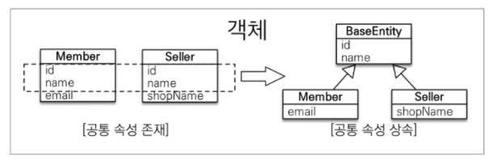      
        설명이 잘 된 사진   

        그 외에도 Data Transfer Object 를 사용하는 것이나   
        기본적인 Controller, Service, Repository, DTO, Model 구조도 나왔습니다.   
        </details>
        <br>
  
      * <details>
        <summary>느낀 점</summary>
        <br>
        
        부족한 점이 없는 좋은 강의였습니다.   
        동기분들의 예기로는 @annotation 들에 대한 설명이 조금 부족하다는 예기도 있었습니다만   
        부족하면 우리는 구글링으로 채워나가면 됩니다.   
        <br>
        역시 구글은 최고의 사수... 파망은 갓갓갓인 것인가?   
        </details>
        <br>
  
      * <details>
        <summary>퀴즈</summary>
        <br>
        
        퀴즈로는 기본적인 CRUD 를 spring 으로 구성하는 것입니다.   
        저의 정답
          * [Person](sparta/backend/spring/week2/src/main/java/com/sparta/week2/domain/Person.java)
          * [PersonRequestDTO](sparta/backend/spring/week2/src/main/java/com/sparta/week2/domain/PersonRequestDTO.java)
          * [PersonRepository](sparta/backend/spring/week2/src/main/java/com/sparta/week2/domain/PersonRepository.java)
          * [PersonService](sparta/backend/spring/week2/src/main/java/com/sparta/week2/service/PersonService.java)
          * [PersonController](sparta/backend/spring/week2/src/main/java/com/sparta/week2/controller/PersonController.java)
        </details>
        <br>
    
  * ### 웹개발의 봄 스프링 3주차
    * #### HTML, CSS, Javascript 기초, 2주차 복습
      * <details>
        <summary>수업에서 제공된 내용</summary>
        <br>
  
        웹개발 기초 강의에서의 내용들이 반복되어 나옵니다.   
        또한 2주차 때 배운 Repository,Service,Controller의 내용들을 복습합니다.   
        
        수업의 진행은 [메모장](http://spring.spartacodingclub.kr/timeline) 을 만들며   
        spring과 연결하는 것을 배우면서 기초 내용들을 적용합니다.   
        </details>
        <br>
  
      * <details>
        <summary>느낀 점</summary>
        <br>
  
        이번 강의에서는 복습하는 내용들을 진행하면서도 새롭게 배우는 내용이 2개 숨어있었습니다.   
        <br>
        첫번째로   
        Timestamped 에서 `@MappedSuperclass` 를 사용하면서 실제 Timestamed의 내용이 response에서 나오지 않는데 
        강의 중에서는 해당 클래스에서 `@Getter` 를 추가하지 않았고, 또  Application 에서 `@EnableJpaAuditing`를 추가하지 않아서 그렇다고 간략하게 나오는데...   
        <br>
        `@Getter`는 스프링에서 사용한다 치고   
        `@EnableJpaAuditing` 요녀석을 모르는데...   
        <br>
        스프링 api 문서에서는 "Annotation to enable auditing in JPA via annotation configuration." 이라고 나옵니다.   
        간략히 하면 @annotation 으로 jpa 의 적용이 가능하게 하는 @annotation 입니다.   
        정확히 하면 [Timestamped](sparta/backend/spring/week3/build/classes/java/main/com/sparta/week3/domain/Timestamped.class) 클래스에서 `@CreatedDate` 와 `@LastModifiedDate` 이 
        적용되게 하는 @annotation 인 것 같습니다.   
        <br>
        `@CreatedDate`랑 `@LastModifiedDate`는 기본적으로 많이 사용한다고 강의에서 나오니까   
        `@EnableJpaAuditing`은 습관적으로 추가하는 것이 좋을 것 같아요.
        <br>
        두번째로   
        숙제가 정말 즈어어엉말 좋은 내용입니다.   
        숙제에 대한 설명은 아래 드랍다운 ㄱㄱ    
        
        </details>
        <br>
  
    * <details>
      <summary>숙제</summary>
      <br>
  
      이번 강의에서의 숙제는   
      게시글 중 어제부터 계시된 글을 게시된 순서로 jpa에서 받으세요.   
      라는 숙제였습니다.   
      우선 [spring 공식 query 표](https://docs.spring.io/spring-data/jpa/docs/current/reference/html/#jpa.query-methods.query-creation) 를 참고하면서 만들고 있었습니다.   
      그런데 단일한 예시만 나와서 두가지 조건이 같이 사용되는 방법을 몰라서 구글링으로 삽질하다 찾았습니다.   
      <br>
      `findAllBy CreatedAt GreaterThan OrderBy CreatedAtDesc` 다음과 같은 순서로 이어집니다.   
      여기에서 CreatedAt GreaterThan 은 CreatedAt의 타입인 `LocalDateTime`을 변수로 받아 비교하는데 사용합니다.   
      이어지는 순서는 SQL 쿼리 문의 순서와도 같습니다.    
      필터 조건을 먼저 주고, 그 다음에 순서를 나열합니다.   
      
      좋은 퀴즈여서 즐거웠습니다.   
      </details>
      <br>

  * ### 웹개발의 봄 스프링 4주차
    * #### 복습, @Scheduled, @Component
      * <details>
        <summary>수업에서 제공된 내용</summary>
        <br>
        
        전체적인 [템플릿](http://spring.spartacodingclub.kr/) 을 제공합니다.   
        위 템플릿을 조작하며 3주차 때 배운 내용들을 다시 다 복습합니다.    
        <br>
        다만 이번 주차에는 네이버 쇼핑 검색 api를 추가하며 spring 에서 cron job를 사용하는 방법, bean 과 `@Component`의 이해가 추가적으로 나옵니다.   
        
        `@Scheduled(cron = "0 0 1 * * *")`   
        이 function 앞에 들어옵니다.   
        
        각각의 값들은 초, 분, 시, 일, 월, 주 순서입니다.   
        위의 값은 1시마다 cron job function을 수행하라는 내용입니다.   
        
        주를 어떻게 설정하는지 궁굼해져서 api를 찾아봤는데   
        "For example, "0 * * * * MON-FRI" means once per minute on weekdays   (at the top of the minute - the 0th second)."   
        이라고 나옵니다.   
        
        초가 0초가 되는 것은 매 분이 시작되는 지점입니다.   
        MON-FRI 와 같이 주일을 설정한 것을 볼 수 있습니다.   
        
        `@Scheduled`가 실행됙기 위해서는 application 위에 `@EnableScheduling`를 추가하셔야 합니다.   
        
        또한 `@Component`에 대한 내용이 제공될 때   
        Spring 에서 자동적으로 찾아서 사용할 수 있게 하며 `@Service`, `@RestController` 또한 이 원리로 주고 받을 수 있습니다.   
        
        bean에 대한 설명은 없었지만 이는 조금 더 심화된 내용이여서 배제한 것 같습니다.
        </details>
        <br>
  
      * <details>
        <summary>느낀 점</summary>
        <br>
            
        cron job같이 모르는 내용이 나왔을 때 유심히 들었습니다.   
        cron job는 aws의 cloudwatch alarm에서 한번 사용한 적은 있지만   
        spring에서도 이렇게 편리하게 사용이 가능하게 했는지는 몰랐습니다.   
        역시 봄빛이지~   
        
        `@bean`에 대한 내용이 기억났을 때 spring의 내부 구조를   
        저도 실은 아직 완벽하게 모릅니다...   
        이 강의들을 빨리 듣고 인프런에서 강의를 들어야 겠습니다.   
        토비의 스프링도 유튜브에 강의가 있던 것 같은데...   
        `flush`와 같은 function 들도 배우고 싶어요.   
        전에 듣던 외국인 강의는 정말 간략하게 소개만 해서 이게 뭔지 이해가 아직 안되었습니다.   
        계획에서 남은건 전진뿐!!!!   
        </details>
        <br>
  
    * <details>
      <summary>숙제</summary>
      <br>
  
      이번 숙제는 최저가를 변경하는 request의 controller, requestDto를 생성하고 js와 연결하는 숙제였습니다.   
      저의 정답 :   
      [ProductRestController](sparta/backend/spring/week4/src/main/java/com/sparta/week4/controller/ProductRestController.java)   
      [ProductMypriceRequestDto](sparta/backend/spring/week4/src/main/java/com/sparta/week4/models/ProductMypriceRequestDto.java)   
      [basic.js](sparta/backend/spring/week4/src/main/resources/static/basic.js)
      </details>
      <br>
  
  * ### 웹개발의 봄 스프링 5주차
    * #### AWS, GRADLE build
      * <details>
          <summary>수업에서 제공된 내용</summary>
          <br>
  
          스프링을 AWS에 올리는 방법에 대하여 배웁니다.   
          AWS에 대한 내용은 웹 기초 5주차 때 배우지만 역시 다른 프레임워크를 배울 때는 새로운 느낌으로 다시 시작합니다.   
          
          jdk ubuntu 설치   
          `sudo apt-get install openjdk-8-jdk`   
          설치 확인   
          `java -version`   
          실행   
          `java -jar 파일명.jar`   
          포트 포워딩   
          `sudo iptables -t nat -A PREROUTING -i eth0 -p tcp --dport 80 -j REDIRECT --to-port 8080`   
          nohup 배포 지속   
          `nohup java -jar 파일명.jar &`   
          
          제공되지 않았지만 알아두면 좋은 내용   
          `server.port = 80` 를 application.properites 에 추가하시면 :8080 하실필요 없습니다.   
          물론 https를 사용하신다면 443을 넣어두셔야 합니다.   
          포트포워딩을 sh파일에 넣어서 관리하시는 것도 좋지만 간단하게 해결할 수도 있습니다.   
          
          다만 포트포워딩 코드는 유용해서 어디 기록해두시고 두고두고 사용하시면 좋을 것 같아요.   
          </details>
          <br>
  
      * <details>
          <summary>느낀 점</summary>
          <br>
  
          사랑하는 aws 수업이 돌아왔습니다.   
          nohup같은 내용은 웹개발 5주차의 내용이 반복되지만 반복 숙달도 공부라서 따라하도록 합시다.   
          
          가비아의 DNS? 가 한국 주변에 위치하여 더 빠른지는 모르겠지만   
          강의 자료들은 모두 가비아를 사용하는 것 같습니다.   
          조금 더 전문적으로 사용하고 싶으시다면 AWS의 route53를 사용하시는 것을 추천드립니다.   
          aws의 내부 서비스와 직접적인 연결이 가능합니다.   
          너무나 유용...   
          
          http://selectshop.wanderer99.com/
          
          도메인을 사는데 돈이 아까워서 이전 프로젝트에서 레코드만 바꿔 올렸다는 것은 팀원들에게 비밀 ㅋㅋ   
          </details>
          <br>
  
    * <details>
        <summary>숙제</summary>
        <br>
  
        직접 서버에 올린 url을 보여주는 것이 숙제입니다.   
        수업을 잘 따라오셨다면 숙제는 문제가 없습니다.   
        [나의 정답](http://selectshop.wanderer99.com/)
        </details>
        <br>
  
  * ### Spring 심화반 1주차
      * #### Serverlet vs Spring
        * <details>
          <summary>수업에서 제공된 내용</summary>
          <br>
       
          이번 주차에서는 스프링이란 기술이 왜 주력이 되었는지,    
          과거에 쓰였던 serverlet 과 비교하면서 그 효용성을 강조하는 강의였습니다.    
          
          예를 들어...   
          serverlet
          ```java
          @WebServlet(urlPatterns = "/api/products/*", loadOnStartup = 1)
          public class AllInOneServlet extends HttpServlet {
          // 신규 상품 등록
          @Override
          protected void doPost(HttpServletRequest request, HttpServletResponse response) throws IOException {
            // 요청 Body 의 JSON -> 자바 객체
            ProductRequestDto requestDto = null;
            StringBuffer jb = new StringBuffer();
            String line = null;
            try {
            BufferedReader reader = request.getReader();
            while ((line = reader.readLine()) != null)
            jb.append(line);
              ObjectMapper objectMapper = new ObjectMapper();
              requestDto = objectMapper.readValue(jb.toString(), ProductRequestDto.class);
            } catch (Exception e) { /*report an error*/ }
            // 관심 상품 DB 에 저장
            // 자바 객체 -> JSON 으로 변환
            ObjectMapper objectMapper = new ObjectMapper();
            String productJson = objectMapper.writeValueAsString(product);

            // 응답 보내기
            response.setContentType("application/json");
            response.setCharacterEncoding("UTF-8");
            PrintWriter out = response.getWriter();
            out.print(productJson);
            out.flush();
            }
          }
          ```
          spring   
          ```java
          @RestController // JSON으로 데이터를 주고받음을 선언합니다.
          public class AllInOneController {
          // 신규 상품 등록
          @PostMapping("/api/products")
          public Product createProduct(@RequestBody ProductRequestDto requestDto) throws SQLException {
            // 관심 상품 DB 에 저장
            // 응답 보내기
            return product;
            }
          }
          ```
          
          코드의 길이만 봐도 그 차이나 느껴집니다.   
          또한 serverlet 의 경우 `HttpServletRequest request` 를 오브젝트로 받아서 사용하는데 반해,   
          spring 은 `@PathVariable`, `@RequestParameter`, `@RequestBody` 같이 request 의 원하는 부분만 바로 사용 가능합니다.   
          
          `@RestController` 같이 그 리턴 타입을 json 으로 default 로 만드는 것과 같이,   
          사용자의 편의를 위해 고려하고 간략화 한 점을 볼 수 있습니다.   
          
          또한 이 강의에서는 allInOne function 들을 만들어 그 코드를 리펙토링 하는 강의이기도 했습니다.    
          전 강의의 MVC 모델의 복습이였으며, 그 용도를 더 정확하게 하는 강의였습니다.   
          
          예를 들어 service 가 비즈니스의 로직을 보유하고 있어야 하며,   
          그 비즈니스 로직 또한 다양한 service 들로 구분해야 한다. 같은 내용을 강조하는 것 같습니다.   
          
          </details>
          <br>
  
        * <details>
          <summary>느낀 점</summary>
          <br>
  
          이번 강의는 복사 붙여넣기가 많습니다.   
          물론 serverlet 을 배우는 강의가 아니라, spring 이 serverlet 을 감싸면서 얼마나 간략하고 효용적으로 만들었는지를 알아보는 강의이기에 
          그리 중요한 내용들이 있지는 않았습니다.     
          
          리펙토링 외 나머지는 복습하는 내용이라서 이해한다 싶으면 빨리 넘어가면 좋을 것 같습니다.   
          </details>
          <br>
  
  * ### Spring 심화반 2주차
      * #### Spring Security
        * <details>
          <summary>수업에서 제공된 내용</summary>
          <br>
       
          설치   
          `implementation 'org.springframework.boot:spring-boot-starter-security'`   
          ```
          <properties>
          <spring-security.version>5.3.4.RELEASE</spring-security.version>
          <spring.version>5.2.8.RELEASE</spring.version>
          </properties>
          <dependency>
          <groupId>org.springframework.security</groupId>
          <artifactId>spring-security-core</artifactId>
          <version>${spring-security.version}</version>
          </dependency>
          ```
          initializer, intellij 로 설치하셔도 상관 없습니다.   
          
          </details>
          <br>
  
        * <details>
          <summary>느낀 점</summary>
          <br>
  
          </details>
          <br>
  
      * #### 주제
        * <details>
          <summary>수업에서 제공된 내용</summary>
          <br>
   
          </details>
          <br>
  
        * <details>
          <summary>느낀 점</summary>
          <br>  
          
          </details>
          <br>
      
      * #### 주제
        * <details>
          <summary>수업에서 제공된 내용</summary>
          <br>
       
          </details>
          <br>
          
        * <details>
          <summary>느낀 점</summary>
          <br>
  
          </details>
          <br>
  
      * <details>
        <summary>숙제</summary>
        <br>
        
        </details>
        <br>
  
  * ### Spring 심화반 3주차
      * #### 테스트
        * <details>
          <summary>수업에서 제공된 내용</summary>
          <br>
       
          블랙박스 테스팅   
            * 내부 구조나 작동 원리를 모르는 상태에서의 검사 방법   
              사용자의 테스팅    
              어떠한 기능을 할지 예상이 안되는 상황에서 사용자가 원하는 기능이 예측대로 동작 하는지 확인하는 방식   
          
          개발자 테스트   
            * 개발자 본인이 작성한 코드를 검증하는 테스트 코드를 활용하는 방법      
              테스트 자동화도 가능   
              기존 코드가 동작한다는 보증   
              전체적인 개발 시간이 오래 걸린다.   
              코드가 변경되면 테스트 코드 또한 유지 보수가 되어야 한다.    
              
          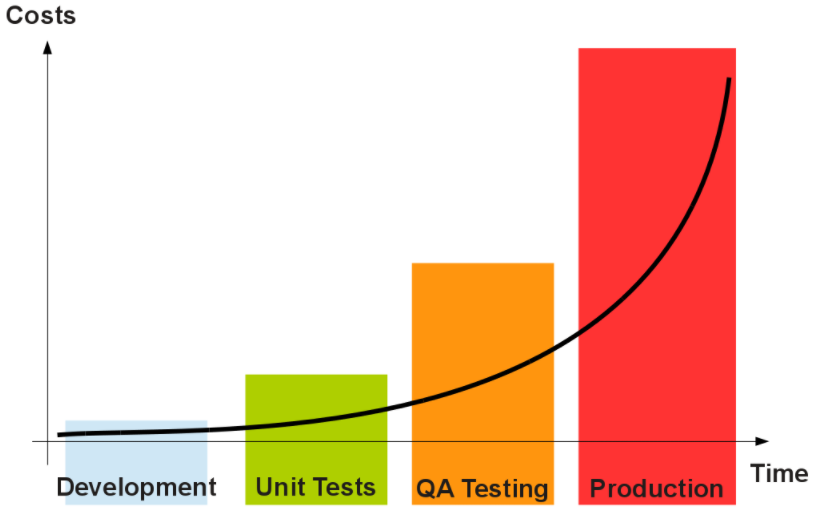    
          실제 product 으로 출시 된 이후에 error 가 발생할 경우 그 비용은 크게 늘어납니다.   
          마케팅, 출시까지 완료된 제품이 에러 때문에 구매가 일어나지 않는다고 생각해시면,   
          그 문제가 얼마나 심각한지 알 수 있습니다.   
          구글 광고는 클릭당 1000원 이상도 나옵니다. 생각만 해도 아찔하죠?   
          </details>
          <br>
  
        * <details>
          <summary>느낀 점</summary>
          <br>
  
          위 내용은 테스트의 필요성을 강조하는 내용이였습니다.   
          테스트 케이스를 작성하는 개발자가 되자는 다짐을 합시다.   
          나는 귀찮지 않다. 나는 귀찮지 않다... 나는...   
          </details>
          <br>
  
      * #### JUnit
        * <details>
          <summary>수업에서 제공된 내용</summary>
          <br>
          
          테스트 케이스 작성   
          ctrl+shift+t   
          나오는 화면에서 JUnit 을 선택하면 됩니다.   
          
          ```java
          @Test
          @DisplayName("URL 형태 : 비정상 (null)")
          ``` 
          다음과 같은 @Annotation 이 사용됩니다.   
          
          JUnit 의 테스트는 `assert`를 많이 사용합니다.   
          
          `assert`   
          의 의미는 "되어야 한다" 라는 의미입니다.   
          
          `assertNull(val)`   
          val 이 null 이 되어야 한다.    
          `assertNotNull(val)`   
          val 이 null 이 되면 안된다.        
          `assertEquals(val1, val2)`    
          val1 이 val2 와 일치해야 한다.    
          
          수업에서 제공되지 않은 추가적인 내용    
          `assertEquals(val1,val2,"msgStr")`   
          message 용도의 string 을 추가할 수 있습니다.      
          ```java
          assertAll(
             ()->assertEquals(1,2),
             ()->assertEquals(3,3),
             ()->assertEquals(4,4)
          );
          ```
          assertAll 내의 모든 assert 가 수행되어야 한다.   
          `assertArrayEquals(arr1, arr2)`   
          array 를 위한 function 은 따로 있습니다.   
          `assertTimeOut(duration, executable)`      
          람다의 수행 시간을 체크합니다. 유용할 수 있을 것 같습니다.   
          `assertThrow(throwable, executable)`   
          executable 을 수행하면 throwable 가 발생할 것이다.      
          
          그 외의 function 들은 assert 의 의미를 생각하시며 보신다면   
          사용하는데 어려움이 없을 것이라 믿습니다.   
          </details>
          <br>
  
        * <details>
          <summary>느낀 점</summary>
          <br>  
   
          저는 assert 는 쉬운 내용으로 알고 있어서,     
          구글링이랑 ide 조금 만져보면서 더 추가하였습니다.    
          수업에서는 더 간략하게 내용이 나옵니다.    
          
          실제로는 Assert 가 중요한 내용이 아닙니다.   
          method 를 테스트 하고 싶을 때 testMethod 에 무엇을 넣어야 하는지 아는 것이 훨씬 더 중요합니다.    
          그 내용은 바로 아래에 있습니다.   
          
          그런데 나는 왜 assert 를 파고 있었을까요...?    
          언행 불일치...      
          삽질 중독...    
          </details>
          <br>
      
      * #### Edge Case 작성
        * <details>
          <summary>수업에서 제공된 내용</summary>
          <br>
          
          // Given   
          // When   
          // Then    
          
          테스트 케이스의 규정 같은 주석입니다.    
          코드스니펫으로 사용하도록 합시다.    
          
          수업에서 edge case 를 test 하는 좋은 예시가 나왔습니다.   
          예를 들어 url 의 valid 유무를 테스트하는 `urlValidator` 를 만들었다고 합시다.   
          
          url 이 주어질 수 있는 모든 edge case 를 생각해봅니다.   
          
          정상적으로 주어질 수 있습니다.   
          null 일 수 있습니다.   
          빈 문자열 일 수 있습니다.   
          형식이 맞지 않을 수 있습니다.   
             * http 나 https 가 아닐 수 있습니다.   
             * .com 같은 형식으로 끝나지 않을 수 있습니다.   
             * ASCII 가 아닐 수 있습니다.(모든 url 은 ascii 로 보내집니다)    
             * ...etc
          접속이 안될 수 있습니다.   

          이렇게 생각해 볼 수 있습니다.    
          
          그렇다면 `urlValidator` 의 테스트는 어떻게 작성되어야 할까요?   
          
          정상일 경우    
          ```java
          // given
          String url = "https://github.com/dohyung97022/hangHae99Guide";
          // when
          boolean isValid = UrlValidator(url);
          // then
          assertTrue(isValid);
          ```
          
          null 일 경우   
          ```java
          // given
          String url = null;
          // when
          boolean isValid = UrlValidator(url);
          // then
          assertFalse(isValid);
          ```
          
          조금씩 엗지 테스트 케이스가 감이 오기 시작했습니다.      
          
          좋은 때에 조금 더 응용된 내용이 나옵니다.   
          
          위의 url 의 경우들 중에   
          ```
          형식이 맞지 않을 수 있습니다.
            * http 나 https 가 아닐 수 있습니다.
            * .com 같은 형식으로 끝나지 않을 수 있습니다.
            * ASCII 가 아닐 수 있습니다.(모든 url 은 ascii 로 보내집니다)
          ```
          이 부분을 테스트 할 때에는 어떻게 해야 할까요?   
          ```java
          @Nested
          @DisplayName("url 형식 케이스")
          class urlFormCase{
            ...
          }
          ``` 
          같이 구분지어 주신다면   
          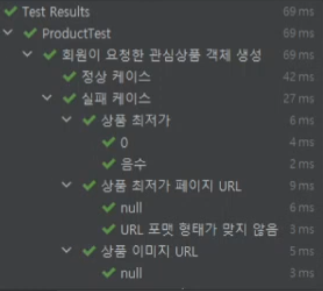    
          같이 정리되어 나옵니다.   
          
          method 가 여러가지 parameter 를 받는다면 어떻게 해야 할까요?   
          
          `method(val1, val2, val3)` 같이 말이죠.   

          ```java
          @Test
          @DispalyName("methodTest")
          class methodTest{  
            @Nested
            @DisplayName("val1")
            class val1Test{
                @Nested
                @DisplayName("null check")
                class val1NullTest{
                    ...
                } 
            } 
            @Nested
            @DisplayName("val2")
            class val2Test{
                @Nested
                @DisplayName("null check")
                class val2NullTest{
                    ...
                } 
            } 
            @Nested
            @DisplayName("val3")
            class val3Test{
                @Nested
                @DisplayName("null check")
                class val3NullTest{
                    ...
                } 
            } 
          }
          ```
          같이 구성하실 수 있습니다.   
          각각의 val1과 val2, val3 의 값들을 edge case 를 다 작성하실 수 있는 것입니다.   
          </details>
          <br>
          
        * <details>
          <summary>느낀 점</summary>
          <br>
          
          모르는 내용이 나오면 흥분해서 적습니다. ㅋㅋㅋㅋㅋㅋㅋ         
          계속 배운다는게 프로그래밍의 매력이긴 하죠.   
          직장으로서는 단점이기도 합니다.   
          여하튼 이런 유용한 내용을 처음 알았다는 것이 너무 좋았습니다.      
          이번 강의의 내용은 너무 좋았습니다.   
          앞의 반복되던 ctrl+c, ctrl+v, 코드 설명 같은 강의들보다 훨씬 좋았습니다.   
          </details>
          <br>
  
      * <details>
        <summary>숙제</summary>
        <br>
        
        </details>
        <br>
                
* ## 시스템
    * ### 면접
        * <details>
          <summary>면접구성</summary>
          <br>

          서류면접 -> 대면면접 -> 최종합격
          </details>
          <br>
        * <details>
          <summary>서류면접</summary>
          <br>

          서류 면접은 직접 확인하시기 바랍니다.   
          제가 지원한 21년도 1분기와 다를 수 있습니다.   
          결제 없이 확인 가능합니다.
          </details>
          <br>

        * <details>
          <summary>대면면접</summary>
          <br>

          면접의 내용은 코딩 중심적이지 않았습니다.  
          서류면접에 관련된 내용을 토대로 질문하며 추가적으로    
          끈기, 몰입, 노력, 성품에 대하여 물어보았습니다.   
          질문으로 받은 것을 예로 들면   
          '과거 끈기 있게 무엇을 끝까지 한 적이 있나요?'   
          '인간관계가 어려워지면 어떻게 하시나요?'   
          '프로그래머가 되기 위하여 어떠한 노력을 하셨나요?'   
          같은 질문이 있었습니다.   
          항해 99는 팀원들끼리 서비스를 직접 런칭하는 부트캠프라서   
          역량과 인간관계에 관련된 질문들로 구성한 것이 인상 깊었습니다.   
          선하고 성실하시다면 합격입니다. ㅋㅋ  
          </details>
          <br>
             
        * <details>
          <summary>최종합격</summary>
          <br>

          최종 합격이 되었다는 카톡이 오고 결제를 완료하시면 이런 카톡이 옵니다.   
          카톡을 받은 이후 항해99 슬랙에 가입하라는 문자가 몇 일 이후에 왔습니다.
          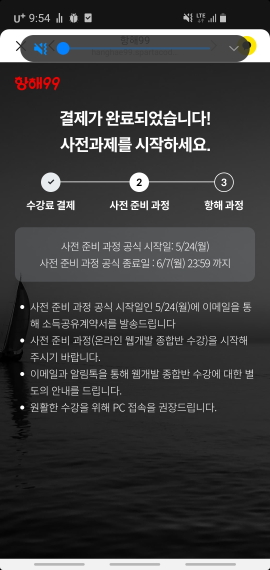
          </details>
          <br>
  

<br>

readme 용 드랍다운. 귀찮으니 복붙 ㄱㄱ
```
<details>
<summary>드랍다운</summary>
<br>

드랍다운 내용
</details>
<br>

# 아래는 tab를 한번 하고 붙여쓰기!
      
* ### 수업
  * #### 수업 주제
    * <details>
      <summary>수업에서 제공된 내용</summary>
      <br>
      </details>
      <br>
      
    * <details>
      <summary>느낀 점</summary>
      <br>
      </details>
      <br>
    
    * <details>
      <summary>퀴즈</summary>
      <br>
      </details>
      <br>
  
  * #### 수업 주제
    * <details>
      <summary>수업에서 제공된 내용</summary>
      <br>
      </details>
      <br>
      
    * <details>
      <summary>느낀 점</summary>
      <br>
      </details>
      <br>
      
    * <details>
      <summary>퀴즈</summary>
      <br>
      </details>
      <br>
  * <details>
    <summary>숙제</summary>
    <br>
    </details>
    <br>
```
