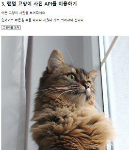

# hangHae99Guide
### 이 repository 는 :
항해 99 부트캠프를 진행하면서 배우고 느낀 점을 기록하는 공간입니다.   
항해 99를 고려하고 있으시거나 궁굼하시다면 도움이 되길 바랍니다.   
<br/>
## 목차
* #### 일간 기록   
* #### 공부   
    * 웹개발 좋합반 1주차
    * 웹개발 종합반 2주차
    * 웹개발 종합반 3주차
* #### 시스템   
    * 면접

<br/>

* ## 일간 기록
    * #### 21/5/22

<br/>

* ## 공부
    * ### 웹개발 종합반 1주차
      * #### 수업에서 제공된 내용
        * 기본적인 html, CSS, javascript 관련된 초초초 기초들을 배웁니다.
      * #### 느낀 점
        술자는 과거 프로젝트를 진행한 적이 있어 빠르게 넘어갔지만   
        1주차는 아마 코딩에 대한 지식이 전혀 없을 수 있는 초보분들을 고려한 내용으로 보입니다.   
        재미있는 점은 강의마다 숙제를 낸다는 점입니다.
      * #### 숙제
        * CSS와 html의 기초적 이해를 요구하는 숙제...   
          CSS를 전에 많이 사용하였지만 AWS 자격증을 준비하느라 다 휘발성 메모리가 되었나 봅니다. ㅋㅋ  
          기억이 새록새록 돌아오는 경험이였습니다.   
          [저의 정답](sparta/frontend/01_homework.html)   
        * 
    
    * ### 웹개발 종합반 2주차
      * #### jQuery
        * <details open>
            <summary>수업에서 제공된 내용</summary>
          <br>
          
          * `https://ajax.googleapis.com/ajax/libs/jquery/3.5.1/jquery.min.js`
          * `$('#idselector')`
          * `$('#idselector').hide`
          * `$('#idselector').show`
          * `$('#idselector').val()`
          * `$('#idselector').val("anyValue")`
          * `$('#idselector').text("anyText")`
          * `$('#idselector').css("cssAtribute")`
          * `let tmp_btn = <button>click</button>` `$('#idselector').append(tmp_btn)`
          * `$('#idselector').empty()`
          </details>
          <br>

        * <details open>
            <summary>느낀 점</summary>

          제공된 [html template](sparta\frontend\02_article.html)에서 `$('selector')`를 통해 사용할 수 있는 기능들에 대하여 배웠습니다.   
          jQuery는 javascript의 코드를 간략하게 하기 위한 라이브러리입니다.   
          저는 react 부터 시작한 사람이라서   
          static website에 jQuery를 통한 웹 기능 구현에 익숙하지 않았습니다.   
          S3 같은 곳에 static website의 구현을 요구할 지도 모르는데   
          아무리 현업이 react 범벅?이 되어 있다고 하더라도 이러한 방법을   
          이해하는 것도 중요하다고 생각됩니다.      
          간편하고 저렴하고 빠른 방법이 될 수 있겠다는 생각이 들었습니다.
          </details>
          <br>
  
        * <details open>
            <summary>퀴즈</summary>
          
          [저의 정답](sparta/frontend/02_jQuery_quiz.html)   
          Static website에서 버튼 클릭으로 인한 기능을 jQuery로 구현하는 퀴즈였습니다.
          
          </details>
          <br>
  
      * #### Ajax, JSON
        * #### 수업에서 제공된 내용
          * 특정 url에서 Get 받기
            ```
            $.ajax({ type: "GET", 
            url: "api.myapi.com",
            data: {},
            success: 
            function(response){
                console.log(response)
              }
            })
            ```
        * #### 느낀 점 
          Ajax는 jQuery에서 import되어 web response를 받는 라이브러리입니다.   
          저는 Ajax를 많이 들어본 적은 있었지만 직접적으로 사용해 본 적은 이번이 처음이였습니다.   
          React의 Axios framework를 사용하였지만 더 기본적인 라이브러리를 볼 수 있는 경험이였습니다.  
          다만 w3school은 ajax에서 XMLHttpRequest를 더 중심적으로 교육하는 것 같습니다.   
          API Hierarchy : jQuery.get/post > jQuery.ajax > XMLHttpRequest  
          참고 : [StackOverflow의 고인물들...](https://stackoverflow.com/questions/4657287/what-is-the-difference-between-xmlhttprequest-jquery-ajax-jquery-post-jquery)
        * #### 퀴즈
            [서울 미세먼지 API](http://openapi.seoul.go.kr:8088/6d4d776b466c656533356a4b4b5872/json/RealtimeCityAir/1/99), [따릉이 API](http://spartacodingclub.shop/sparta_api/seoulbike), [카와이한 고양이 API](https://api.thecatapi.com/v1/images/search)   
            위 API를 통하여 static website를 변동시키는 퀴즈였습니다.   
            [저의 정답](sparta/frontend/02_Ajax_quiz.html)   
               
            아... 커여워....
          
      * #### 숙제
        * 1주차 때 만들었던 템플렛에 환율 정보를 추가하는 것이 숙제로 나왔습니다.   
        [저의 정답](sparta/frontend/02_homework.html)   
        
          
    * ### 웹개발 종합반 3주차
      * #### Python / BeautifulSoup
        * #### 수업에서 제공된 내용
          `list = ['l','i','s','t']`   
          `dictionary = {'id':value}` `dictionary['id'] = value`
          ```
          def func(param):
            return param
          ```
          ```
          if a > 20:
            print(a)
          ```
          ```
          for c in ['l','i','s','t']:
            print(c)
          ```
          ```
          for c in [{name:kim,age:25},{name:jun,age:23},{name:min,age:20}]:
            print...
          ```
          `pip install`   
          ```
          import requests
          reqJson = request.get('url').json()
          ```   
          ```
          import beautifulSoup
          soup = BeautifulSoup(reqJson.text,'html.parser')
          soup.select_one('#id > .class > div')
          ```
        * #### 느낀 점
          * 저는 크롤링/스크레이핑을 사랑합니다. 반가운 내용이 나왔네요.   
            그 외에는 기본적인 python 지식, 자료구조를 가볍게 넘어갑니다.   
            수업 내용은 쉬운 편입니다.   
            혹여나 크롤링/스크레이핑에 관심이 많으신 분이 게신다면 저만의 작은 팁이 있습니다.   
            같은 ip 주소에서 지속적으로 request를 보낼 경우 차단될 확률이 매우 높습니다.   
            그래서 ip를 우회해야 하는데, 저는 이 해결 방법으로 AWS lambda를 추천드립니다.  
            lambda는 5분마다 AWS ip pool에서 지속적으로 ip를 순환합니다.   
            심지어 더 많은 ip가 필요하시다면 그냥 코드로 lambda를 생성할 수 있습니다.   
            AWS SDK에서 async invocation도 가능해서 많은 request를 동시다발적으로 받을 수 있습니다.   
            핵꿀팁이라서 이 글을 읽으시는 분들에게만 드립니다... ㅋㅋ   
            저만 알고있는 꿀팁 맞죠? ;;;;
            
      * #### Python / pymongo (mongoDB)
        * #### 수업에서 제공된 내용
          ```
          from pymongo import MongoClient

          client = MongoClient('localhost', 27017)
          db = client.schema
          ```
          
          ```
          # insert
          doc = {'name': 'kim', 'age': 25}
          db.users.insert_one(doc)
          doc = [{'name': 'min', 'age': 20}, {'name': 'jun', 'age': 23}]
          db.users.insert_many(doc)
          ```
          ```
          # find
          same_ages = list(db.users.find({'age': 21}, {'_id': False}))
          user = db.users.find_one({'name': 'bobby'}, {'_id': False})
          ```
          ```
          # update
          db.users.update_one({'name': 'bobby'}, {'$set': {'age': 19}})
          db.users.update_many({'age': 19}, {'$set': {'name': 'adult'}})
          ```
          ```
          # delete
          db.users.delete_one({'name': 'bobby'})
          ``` 
        * #### 느낀 점
          pymongo의 CURD 기능에 대한 소개와   
          스크레이핑을 통해 받은 정보를 저장합니다.   
          
        * #### 퀴즈
          [저의 정답](sparta/backend/python/03_python_MongoDB_Quiz.py)   
          퀴즈는 메트릭스의 평점을 scraping 하는 것입니다.   
          이미 제공되고 해설하는 문제를 푸는 것은 좋지 않다고 생각되어   
          네이버의 최신 영화 api를 훔쳐?보도록 하겠습니다.   
          [네이버의 backend](https://m.search.naver.com/p/csearch/content/qapirender.nhn?_callback=___MovieAPIforPList_key_68_pkid_nexearch_where_1_start_8_display_s1_dsc_so_%ED%98%84%EC%9E%AC%EC%83%81%EC%98%81%EC%98%81%ED%99%94_q&key=MovieAPIforPList&pkid=68&where=nexearch&start=1&display=8&so=s1.dsc&q=%ED%98%84%EC%9E%AC%EC%83%81%EC%98%81%EC%98%81%ED%99%94)
          는 url의 where 이후의 숫자와, &start의 파라미터의   
          숫자에 따라 결과를 달리합니다.
          ```
          for x in ['1', '9', '17', '25', '33']:
          reqHtml = requests.get(
          'https://m.search.naver.com/p/csearch/content/qapirender.nhn?_callback=___MovieAPIforPList_key_68_pkid_nexearch_where_' 
          + x
          + '_start_8_display_s1_dsc_so_%ED%98%84%EC%9E%AC%EC%83%81%EC%98%81%EC%98%81%ED%99%94_q&key=MovieAPIforPList&pkid=68&where=nexearch&start=' 
          + x
          + '&display=8&so=s1.dsc&q=%ED%98%84%EC%9E%AC%EC%83%81%EC%98%81%EC%98%81%ED%99%94')
          ``` 
          다음과 같이 웹에서 사용되는 것을 따라하여 8씩 증가하며 get을 하였습니다.   
          그 이후 beautifulsoup을 사용하려고 하였지만 html에 특화되어 있어   
          Json api call을 받아들이지 못해 그냥 regex를 사용하였습니다.   
          regex 애용한답니다. ㅋㅋ   
          ```
          'this_text _text\\\\">([^<]+)'
          ```
          결과   
          
          그 이후 형식을 변환하고 저장합니다.
          ```
          # array 형식을 dictionary 형식으로 바꾼다.
          movieDicArr = []
          for movieName in movieArr:
          movieDicArr.append({'name': movieName})
          
          # 저장한다.
          db.users.insert_many(movieDicArr)
          ```
          결과   
          
        
      * #### 숙제
        지니뮤직에서 top 50 곡과 그 아티스트를 받는 숙제입니다.   
        [저의 정답](sparta/backend/python/03_homework.py)   
        ```
        titles = re.findall('class="albumtitle[^>]+>([^<]+)<', reqHtml.text)
        artist = re.findall('class="artist[^>]+>([^<]+)<', reqHtml.text)
        ```
        이것도 regex를 사용하여 간단히 했습니다.
    
    * ### 웹개발 종합반 4주차
      * #### Flask
        * #### 수업에서 제공된 내용
        기본 틀
        ```
        from flask import Flask

        app = Flask(__name__)

        @app.route('/')
        def home():
          return 'This is Home!'

        if __name__ == '__main__':
          app.run('0.0.0.0', port=5000, debug=True)
        ```
        html 템플릿 리턴
        ```
        from flask import Flask, render_template
        @app.route('/')
        def home():
          return render_template('index.html')
        ```
        Get request와 ?parameter 받기
        ```
        @app.route('/test', methods=['GET'])
        def test_get():
          parameter = request.args.get('parameter')
          return jsonify({'result': 'success', 'msg': '이걸 주셨나요?' + parameter})
        ``` 
        Post request와 body parameter 받기
        ```
        @app.route('/test', methods=['POST'])
        def test_post():
          post_body_parameter = request.form['body_parameter']
          return jsonify({'result': 'success', 'msg': '이 요청을 주셨나요?' + post_body_parameter})
        ```
        * #### 느낀 점
          이번 시간에는 플라스크의 파일구조와   
          Get/Post request와 url parameter, body parameter를 받는 방법을 배웠습니다.   
          그런데 세상에 마상에...   
          이렇게 간략한 프레임워크가 있다구요?   
          스프링으로는 최소한 `@Entity`, `@Repository`, `@Service`   
          로 구성된 틀을 짜야 하는데... 여기에서는 7줄로 서버가 완성되는 magic 이 일어나고 있습니다.   
          그러나!!!!   
          플라스크보다 스프링이 좋은 이유들도 있습니다.   
          * 스프링의 경우 database integration이 되어 있습니다.
          * 객체 지향적이여서 파일 정리가 쉽습니다.
          * 데이터베이스 또한 하나의 객체로 봅니다.
          * 속도가 스프링이 더 빠릅니다.   
             
            Go 가 제일 빠른데 취직 자리도 없다는게 함정... 슬프다...   
            그냥 spring으로 시작할껄...
        
      * #### Flask + MongoDB + Ajax + jQuery + beautifulSoup
        * #### 수업에서 제공된 내용
            위에서 배운 모든 내용들을 종합하는 내용이였습니다.  
            <br>
            1. Flask로 api를 연다.   
            2. MongoDB로 저장하는 api route를 연다.
            3. Ajax와 jQuery로 parameter로 받는다.   
            4. frontend에 표시한다.
            5. Scraping 또한 활용한다.
        * #### 느낀 점
            프로젝트를 전체적으로 설계/조립하는 것만큼 [satisfaction](https://www.youtube.com/watch?v=a0fkNdPiIL4) 한 것은 없습니다.   
            또한 이번 수업에서 들어 내용 중에 카카오톡이 어떻게   
               
            이러한 기능을 구현한 것인지에 대한 예기가 있었습니다.   
            meta 태그에 이러한 정보들을 넣는 것이 웹의 보편적인 약속인 것을 처음 알았습니다.   
            제 project엔 이런것도 안 넣었는데...   
            조금 공부할 필요가 있네요.   
            [구글/카톡을 위한 react에서 meta tag 지정 방법](https://satisfactoryplace.tistory.com/150)   
            <br/>
            저의 개인적인 감상은 그만두고 조금 더 보편적으로 이야기하자면   
            오늘은 정말 유용한 강의였습니다.   
            어느정도 웹의 특정 부분만 이해하는 사람이라면  
            조금 더 큰 그림을 보여주는 강의였다고 생각합니다.   
            전체적인 구조를 보여주는 프로젝트도 2개나 보여줍니다.   
            <br>
            frontend + backend + mongoDB
          
               
            <br>
            frontend + backend + mongoDB + beautifulSoup   
            
          
      * #### 숙제
        나의 정답 [index.html](sparta/backend/python/04_homework/templates/index.html) / [app.py](sparta/backend/python/04_homework/app.py)   
        이번에는 중간 정도의 난이도가 있는 숙제였습니다.   
        하지만 강의에서 나온 예시를 잘 들어주신 분이라면   
        큰 문제 없이 풀 수 있는 난이도였습니다.   
        <br>
        숙제의 내용은   
        <br>
           
        다음 웹페이지에서부터 입력받은 정보를   
        <br>
           
        mongoDB를 통해 저장하고   
        <br>
           
        저장된 정보를 아래에 표시되게 하는 것입니다.   
        <br>
            
        
            
        
            
* ## 시스템
    * ### 면접
        * #### 면접 구성
            * 서류면접 -> 대면면접 -> 최종합격
        * #### 서류면접
            * 서류 면접은 직접 확인하시기 바랍니다.   
            제가 지원한 21년도 1분기와 다를 수 있습니다.
        * #### 대면면접
            * 면접의 내용은 코딩 중심적이지 않았습니다.  
            서류면접에 관련된 내용을 토대로 질문하며 추가적으로    
            끈기, 몰입, 노력, 성품에 대하여 물어보았습니다.   
            질문으로 받은 것을 예로 들면   
            '과거 끈기 있게 무엇을 끝까지 한 적이 있나요?'   
            '인간관계가 어려워지면 어떻게 하시나요?'   
            '프로그래머가 되기 위하여 어떠한 노력을 하셨나요?'   
            같은 질문이 있었습니다.   
            항해 99는 팀원들끼리 서비스를 직접 런칭하는 부트캠프라서   
            역량과 인간관계에 관련된 질문들로 구성한 것이 인상 깊었습니다.   
            선하고 성실하시다면 합격입니다. ㅋㅋ   
        * #### 최종합격
            * 최종 합격이 되었다는 카톡이 오고 결제를 완료하시면 이런 카톡이 옵니다.   
            카톡을 받은 이후 항해99 슬랙에 가입하라는 문자가 몇 일 이후에 왔습니다.
            * 
